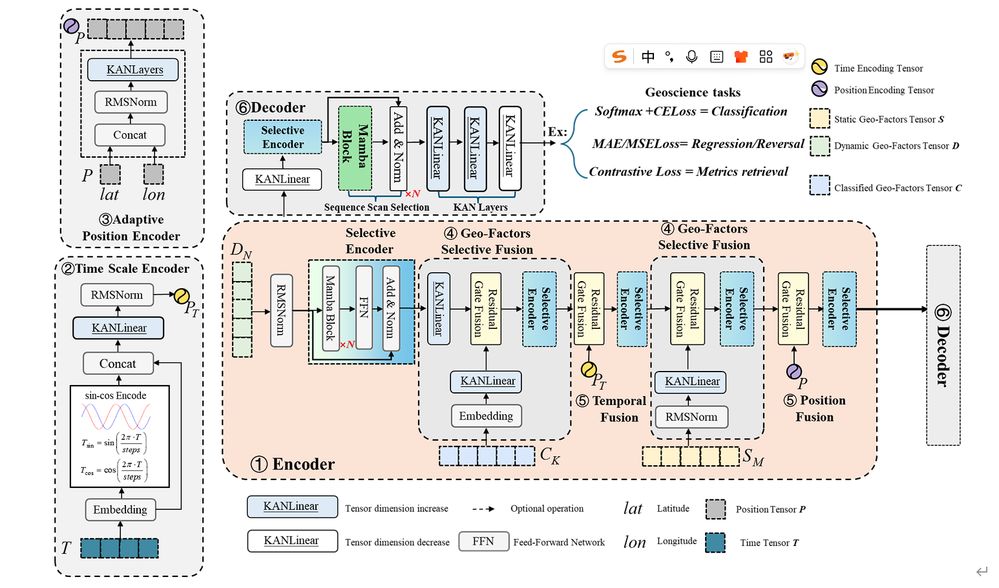

## Overview


Geo-Mamba addresses the complex challenges in Earth science data modeling by leveraging the efficiency of Mamba architectures. Traditional deep learning approaches often struggle with the inherent complexities of geospatial data, including multi-scale temporal dependencies, spatial heterogeneity, and diverse input formats.
## Project Structure


```
.
├── Data    [Experiment Datesets]
├── checkpoints [Model Weight]
├── Datasets
├── LICENSE
├── Nets [Model Networks,Squeence is Squeence(seq>=1) Code]
├── README.md
├── SaclePkl [Scaling]
├── __pycache__
├── efficient_kan
├── images
├── init [Dataset Conversion]
├── logs
├── predict.py [Inference Predictions]
├── requiement.txt
├── train_d.py [Training Scripts]
└── utils.py

```
## Data
[Data GoogleDrive](https://drive.google.com/drive/folders/1F1kF_o3YOHbcOBoHuW3mopKIZb-u4OjD?usp=sharing)

[checkpoints GoogleDrive](https://drive.google.com/drive/folders/10RF2IsGRliXE8u0zOSd37_VBaoL1AAI-?usp=sharing)

[GWSA_year_Reconstruction results](https://drive.google.com/drive/folders/1rN_ExjxunsppQfYmf3wISTtlfeE2k9Qc?usp=sharing)

## Environments
Experiment environments
```bash
python>=3.10
ubuntu 22.04
```
Create development environment
* Install  SSM Mamba: https://github.com/state-spaces/mamba. Note that the same version of Conv1d is installed, currently Mamba only supports GPUs above NVIDIA Ampere.
* Base on Accelerate, please see: https://huggingface.co/datasets/HuggingFace-CN-community/translation/blob/main/eat_accelerate_in_30_minites.md 
```bash
pip install requirements.txt
```


Train/Predict

```bash
# Multi-GPUs
accelerate launch --multi_gpu ./train_d.py
# Signal-GPU
accelerate launch ./train_d.py
# Predict,must Project Structure
python predict.py

```
## Notes
* GWSA Datasets are the datasets we have assembled ourselves, the rest of the datasets FLuxNet2015 datasets are: https://fluxnet.org/data/fluxnet2015-dataset/ 
CLCD datasets are: https://irsip.whu.edu.cn/resources/CLCD.php, we do not have the right to carry it to this project for public use.

* The Geo-Mamaba framework shows a high degree of modularity and flexibility, and its core components can be dynamically adapted according to the task requirements. For example, when dealing with multi-timescale tasks, the multi-scale time encoder (e.g., the divisional coding structure described in the literature 
) can be configured to match the temporal features of different granularities; for multi-factor fusion scenarios, the optimization can be achieved by dynamically adjusting the weight allocation of multi-factors and their fusion order. It is worth noting that this flexibility still requires parameter tuning and architectural adaptation according to specific task requirements in the actual application process. Therefore, in the actual project deployment, its architectural design may differ from the original framework, and modularization and functional expansion should be carried out in combination with specific application scenarios.

## License

This project is licensed under the MIT License - see the [LICENSE](LICENSE) file for details.

## Acknowledgments

We acknowledge the following data sources and institutions:  
- [**FLUXNET2015 Dataset**](https://fluxnet.org/data/fluxnet2015-dataset/): A global flux data repository providing multi-scale ecological observations [[1]](https://fluxnet.org/data/fluxnet2015-dataset/).  
- [**CLCD Remote Sensing Monitoring Platform**](https://irsip.whu.edu.cn/resources/CLCD.php): Contributing land cover data for ecological analysis [[2]](https://irsip.whu.edu.cn/resources/CLCD.php).  
- **NASA** (National Aeronautics and Space Administration): Provider of Earth observation resources.  
- **JPL** (Jet Propulsion Laboratory): Contributor to satellite data infrastructure.  
- **CSR** (Center for Space Research, University of Texas): Source of gravitational field models.  
- **NASA EarthData**: Centralized portal for Earth science data access [[3]](https://earthdata.nasa.gov/).  
- **GLDAS** (Global Land Data Assimilation System): Meteorological forcing data provider.  
- **GLEAM v4** (Global Land Evaporation Amsterdam Model): Source of evapotranspiration datasets.  
- **Google Earth Engine** (GEE): Cloud computing platform for geospatial analysis.  
- **Chinese Ecosystem Research Network** (CERN): National-level ecological monitoring infrastructure.  
- [**Qinghai-Tibet Plateau Data Center**](https://data.tpdc.ac.cn/): Provider of high-altitude environmental data [[4]](https://data.tpdc.ac.cn/).  
- **China Geo-Environmental Monitoring Network**: Geological hazard monitoring system.  

This work also benefits from collaborative frameworks including international flux observation networks and multi-source Earth observation programs.  
## Special thanks to the developers of the Mamba,EfficentKAN Projiects.


